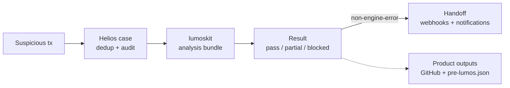

# helios

helios is the case orchestrator in the Lumos incident workflow. It receives
suspicious transaction signals, deduplicates them into tracked cases, runs
`lumoskit` once per case, records the result, and hands completed work to
operators or downstream agents.

It does not detect hacks itself and it does not perform the forensic analysis;
those live in `hack-detector` and `lumoskit`.

Spec: [`seeds/v1.yaml`](seeds/v1.yaml)

## Workflow



1. `hack-detector` or an operator submits a suspicious transaction.
2. Helios creates or reuses a case for `(chain, tx_hash)`.
3. A worker runs `lumoskit --tx --chain --output-root`.
4. Helios reads `summary.json` and maps the engine result to a case outcome.
5. Non-engine-error cases can be handed to downstream agents.
6. Verified and final partial cases can publish GitHub artifacts; verified cases
   can also generate Pre-Lumos JSON.

## Result Cheat Sheet

| Analysis stage | Helios outcome | Rerun decision | Meaning |
| --- | --- | --- | --- |
| `success` | `verified` | `no_rerun` | PoC and RCA cleared the verification gate. |
| `poc_failed` | `unverified` | `manual_review` | PoC failed or was missing, so RCA did not produce a verified result. |
| `poc_blocked` | `partial` | `auto_rerun` | Copies prior deterministic artifacts, reruns `agent_poc`, then runs `rca`. |
| `rca_blocked` | `partial` | `auto_rerun` | Copies prior PoC artifacts and reruns `rca` only. |
| `engine_error` | `engine_error` | `manual_review` | LumosKit failed, summary output was missing/unreadable, or the summary shape was invalid. |

Helios records `analysis_stage`, `rerun_decision`, `rerun_reason`, and the
selected `auto_rerun_resume_stage` on the terminal `state_transition` event.
Automatic reruns are bounded by `HELIOS_PARTIAL_AUTO_RERUN_MAX_ATTEMPTS`.

See [`docs/results.md`](docs/results.md) for the full result payload, MCP usage,
and downstream handoff behavior.

## Run Locally

```bash
go mod tidy
HELIOS_API_TOKEN=dev-token \
HELIOS_DB_PATH=$(pwd)/var/helios.db \
HELIOS_OUTPUT_ROOT=$(pwd)/var/outputs \
go run ./cmd/helios
```

`bin/lumoskit` must be on PATH, or set `HELIOS_LUMOSKIT_BIN`. For local
development without the real engine, use `scripts/fake-lumoskit.sh`.

Optional Telegram alerts can reuse an existing bot, including the hackdetector
bot. Set these as Helios process env vars, either with `export` for local runs
or in the deploy env file such as `/srv/helios/env/helios.env`:

```bash
export TELEGRAM_BOT_TOKEN=<hackdetector-bot-token>
export TELEGRAM_CHAT_ID=<target-chat-id>
```

Helios sends terminal `verified`, `partial`, `unverified`, `engine_error`, and
`handoff_failed` events with `completed_at`, `analysis_stage`,
`rerun_decision`, rerun stage details, and GitHub report links when publish
completes.

Open the UI at the address from `HELIOS_LISTEN_ADDR`:

```text
http://127.0.0.1:8080/ui
```

## Core API

All endpoints except `/healthz` require `Authorization: Bearer $HELIOS_API_TOKEN`.

| Endpoint | Purpose |
| --- | --- |
| `GET /healthz` | container/host probe |
| `POST /signals` | detector submission |
| `POST /cases` | manual/operator submission |
| `GET /cases` | list and filter cases |
| `GET /cases/{case_id}` | case detail, events, handoff attempts, notifications |
| `POST /cases/{case_id}/retry-handoff` | retry failed downstream delivery |
| `GET /metrics` | Prometheus metrics |

## Docs

- [`docs/architecture/overview.md`](docs/architecture/overview.md) - operator workflow and system map
- [`docs/results.md`](docs/results.md) - result semantics, payload examples, MCP-assisted review
- [`docs/operations.md`](docs/operations.md) - configuration, wired surfaces, operational notes
- [`deploy/README.md`](deploy/README.md) - production deployment and smoke tests

## Boundaries

- Detection belongs to `hack-detector`.
- Trace acquisition, CEFG, PoC synthesis, and RCA generation belong to
  `lumoskit`.
- Helios owns ingress, deduplication, queueing, engine dispatch, outcome
  mapping, handoff, notifications, audit events, and metrics.
