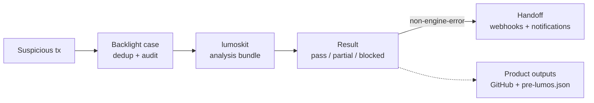

# Backlight

Backlight is BackwardLabs' case orchestrator in the Lumos incident workflow. It receives
suspicious transaction signals, deduplicates them into tracked cases, runs
`lumoskit` once per case, records the result, and hands completed work to
operators or downstream agents.

It does not detect hacks itself and it does not perform the forensic analysis;
those live in `hack-detector` and `lumoskit`.

Spec: [`seeds/v1.yaml`](seeds/v1.yaml)

Compatibility note: the current runtime still uses the legacy `helios` binary,
service paths, and MCP tool namespace. Environment variables now use the
`BACKLIGHT_*` prefix; the old `HELIOS_*` names are no longer read.

## Workflow



1. `hack-detector` or an operator submits a suspicious transaction.
2. Backlight creates or reuses a case for `(chain, tx_hash)`.
3. A worker runs `lumoskit --tx --chain --output-root`.
4. Backlight reads `summary.json` and maps the engine result to a case outcome.
5. Non-engine-error cases can be handed to downstream agents.
6. Verified and final partial cases can publish GitHub artifacts; verified cases
   can also generate Pre-Lumos JSON.

## Result Cheat Sheet

| Analysis stage | Backlight outcome | Rerun decision | Meaning |
| --- | --- | --- | --- |
| `success` | `verified` | `no_rerun` | PoC and RCA cleared the verification gate. |
| `poc_missing` | `unverified` | `manual_review` | Required reconstruction or execution evidence is unavailable. Telegram reports this as **PoC incomplete**, not a failed replay. |
| `poc_failed` | `unverified` | `manual_review` | PoC failed for a non-recoverable reason and requires operator review. |
| `reachable_poc` | `partial` | `guided_repair` | Forge replay passed and RCA can run, but economic proof still needs `agent_poc_repair`. |
| `poc_blocked` | `partial` or `unverified` | `auto_rerun` | A recoverable Forge, static, or ABI gate failed. Copies prior deterministic artifacts, reruns `agent_poc`, then runs `rca` if the replay becomes non-failing. |
| `rca_blocked` | `partial` | `auto_rerun` | Copies prior PoC artifacts and reruns `rca` only. |
| `engine_error` | `engine_error` | `manual_review` | LumosKit failed, summary output was missing/unreadable, or the summary shape was invalid. |

Backlight records `analysis_stage`, `rerun_decision`, `rerun_reason`, and the
selected `auto_rerun_resume_stage` on the terminal `state_transition` event.
Automatic reruns are bounded by `BACKLIGHT_PARTIAL_AUTO_RERUN_MAX_ATTEMPTS`.

See [`docs/results.md`](docs/results.md) for the full result payload, MCP usage,
and downstream handoff behavior.

## Run Locally

```bash
go mod tidy
BACKLIGHT_API_TOKEN=dev-token \
BACKLIGHT_DB_PATH=$(pwd)/var/backlight.db \
BACKLIGHT_OUTPUT_ROOT=$(pwd)/var/outputs \
go run ./cmd/helios
```

`bin/lumoskit` must be on PATH, or set `BACKLIGHT_LUMOSKIT_BIN`. For local
development without the real engine, use `scripts/fake-lumoskit.sh`.

Optional Telegram alerts can reuse an existing bot, including the hackdetector
bot. Set these as Backlight process env vars, either with `export` for local runs
or in the deploy env file such as `/srv/backlight/env/backlight.env`:

```bash
export TELEGRAM_BOT_TOKEN=<hackdetector-bot-token>
export TELEGRAM_CHAT_ID=<target-chat-id>
```

Backlight sends terminal `verified`, `partial`, `unverified`, `engine_error`, and
`handoff_failed` events with `completed_at`, `analysis_stage`,
`rerun_decision`, rerun stage details, and GitHub report links when publish
completes.

### Telegram command bot (inbound)

The same bot can also accept operator commands. Enable it with
`TELEGRAM_COMMAND_ENABLED=true`; it long-polls `getUpdates` (no public ingress,
TLS cert, or webhook required) and only honours commands from the configured
operator chat(s):

```bash
export TELEGRAM_COMMAND_ENABLED=true
# Optional: restrict to specific chat ids (comma-separated). Defaults to TELEGRAM_CHAT_ID.
export TELEGRAM_ALLOWED_CHAT_IDS=<chat-id>[,<chat-id>...]
# Optional: long-poll hold time in seconds (default 30).
export TELEGRAM_COMMAND_POLL_TIMEOUT_SECONDS=30
```

Commands:

- `/signal <tx_hash>` — register an incident. The tx hash rides in the command (so it works in a group without admin/reply); the chain is then picked from inline buttons and the operator confirms with a button. `/signal <chain> <tx> [protocol]` is a one-shot shortcut that jumps straight to the confirm card. Submitted with manual-operator (`POST /cases`) semantics — `source=telegram:<user>`, `detected_at=now` — not the strict hack-detector `/signals` contract. Repeated tx hashes dedup like any other submission.
- `/recent` — list the 10 most recent incidents (protocol · occurrence time · lifecycle status); each row gets a numbered button to open its status.
- `/status <case_id>` — show one case's chain/tx/state/outcome/failure (with a 📄 report button when published) so you can see whether the engine run is queued, running, or finished (and how).
- `/cancel` — abort an in-progress `/signal` flow.
- `/help` — usage.

The flow leans on inline buttons because button taps are delivered to the bot regardless of group privacy mode — only the tx hash must be typed, and it rides in the command. The bot registers the commands with Telegram (`setMyCommands`) at startup, so they appear in the client's `/` command menu. Final analysis results still arrive via the normal notification channel when the worker finishes; `/recent` and `/status` are for on-demand progress checks.

Only one process may long-poll a given bot token at a time, and the bot clears
any stale webhook at startup so polling does not conflict.

Open the UI at the address from `BACKLIGHT_LISTEN_ADDR`:

```text
http://127.0.0.1:8080/ui
```

Production deployments should expose the browser console on
`dashboard.backwardlabs.io` and automation/API surfaces on `api.backwardlabs.io`.
The dashboard host only needs `/ui`, `/cases...`, and `/healthz`; `/signals`,
`/metrics`, `/ecw`, and `/mcp` should be served from the API host.

## Core API

Core API endpoints except `/healthz` require `Authorization: Bearer $BACKLIGHT_API_TOKEN`.
The internal ECW export uses a separate `BACKLIGHT_ECW_EXPORT_TOKEN` and is disabled
when that token is unset.

| Endpoint | Purpose |
| --- | --- |
| `GET /healthz` | container/host probe |
| `POST /signals` | detector submission, exposed on `api.backwardlabs.io` |
| `POST /cases` | manual/operator submission, exposed on both dashboard/API hosts |
| `GET /cases` | list and filter cases, exposed on both dashboard/API hosts |
| `GET /cases/{case_id}` | case detail, events, handoff attempts, notifications, exposed on both dashboard/API hosts |
| `POST /cases/{case_id}/retry-handoff` | retry failed downstream delivery, exposed on both dashboard/API hosts |
| `GET /metrics` | Prometheus metrics, exposed on `api.backwardlabs.io` |
| `GET /ecw/cases/{case_id}/export` | internal ECW replay/RCA bundle export, exposed on `api.backwardlabs.io` with `BACKLIGHT_ECW_EXPORT_TOKEN` |
| `/mcp` | remote MCP endpoint, exposed on `api.backwardlabs.io` when `backlight-mcp` HTTP mode is enabled |

## Docs

- [`docs/architecture/overview.md`](docs/architecture/overview.md) - operator workflow and system map
- [`docs/results.md`](docs/results.md) - result semantics, payload examples, MCP-assisted review
- [`docs/operations.md`](docs/operations.md) - configuration, wired surfaces, operational notes
- [`deploy/README.md`](deploy/README.md) - production deployment and smoke tests

## Boundaries

- Detection belongs to `hack-detector`.
- Trace acquisition, CEFG, PoC synthesis, and RCA generation belong to
  `lumoskit`.
- Backlight owns ingress, deduplication, queueing, engine dispatch, outcome
  mapping, handoff, notifications, audit events, and metrics.
