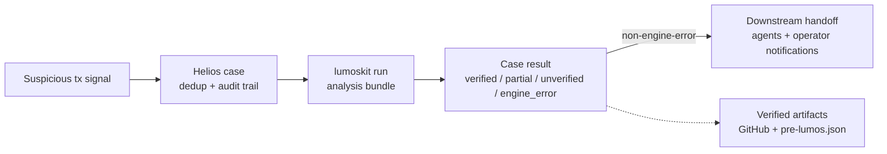

# helios

helios is the orchestrator in the Lumos family. It receives suspicious
transaction signals from `hack-detector`, dispatches `lumoskit` as a child
process per case, and routes the resulting PoC + RCA bundle to downstream
agents. Verified cases can also publish product artifacts to GitHub and generate
importer-ready incident JSON through the Pre-Lumos sidecar.

Specification: `seeds/v1.yaml` (generated by `ouroboros:interview` +
`ouroboros:seed`; QA score 0.88, accepted below the 0.90 threshold).

## Product flow at a glance

Think of Helios as the incident conveyor belt between detection and the final
forensics bundle:

1. **A signal arrives.** `hack-detector` or an operator submits a suspicious
   transaction.
2. **Helios creates a case.** It deduplicates repeat submissions, assigns a
   `case_id`, and keeps an audit trail.
3. **Helios runs the engine.** One `lumoskit` analysis run processes the case
   and writes the output bundle.
4. **Helios classifies the result.** The case becomes `verified`, `partial`,
   `unverified`, or `engine_error`.
5. **Helios starts verified-case side effects.** Verified cases can also
   publish the product bundle to GitHub and run the Pre-Lumos Agent SDK sidecar
   to create importer-ready incident JSON.
6. **Helios hands it off.** Completed non-engine-error cases go to downstream
   webhooks, while operators can track progress in the UI, notifications, logs,
   and metrics.



For the operator-focused system map and full case lifecycle, see
[`docs/architecture/overview.md`](docs/architecture/overview.md).

## What's wired in this build

| Surface | State |
| --- | --- |
| `GET /healthz` | done (unauthenticated for container probes) |
| `GET /` / `GET /ui` | done (browser console for submitting and tracking analysis cases) |
| `GET /metrics` | done (Prometheus default registry, auth required) |
| `POST /signals` | done (validate, dedup, persist, queue) |
| `POST /cases` | done (validate, dedup, persist, `force_rerun`) |
| `GET /cases` | done (filters: state/outcome/chain/tx_hash/created_from/created_to, offset/limit, default `created_at DESC`) |
| `GET /cases/{case_id}` | done (case-detail + events + handoff/notification attempts) |
| `POST /cases/{case_id}/retry-handoff` | done (precondition: state=done AND handoff_status=failed; pending URLs only) |
| Worker (FIFO dispatcher) | done (poll loop + semaphore for max_concurrent) |
| lumoskit child process invocation | done (env pass-through; stderr captured with 64 KiB cap) |
| Outcome mapping (O1..O8) | done (strict precedence O5 → O6 → O7 → O4 → O1 → O2 → O3 → O8) |
| Downstream fan-out | done (per-URL bounded exp backoff, multi-URL aggregation) |
| GitHub product publish | done (verified only, `test/{YYYY-MM}/{Protocol}/`, `Report.md` → `README.md`) |
| Pre-Lumos incident JSON | done (verified only, Agent SDK sidecar, case `pre-lumos.json` + `seed/import_{YEAR}.json`) |
| Operator notifications | done (webhook + Telegram native; 5 events; per-channel retry) |
| Restart recovery | done (orphan running cases → failed/host_restart + linked child queued) |
| Prometheus metrics | done (case_state/outcome counters, queue_depth gauge, lumoskit duration histogram, handoff/notification attempt counters) |

## Run locally

```bash
go mod tidy
HELIOS_API_TOKEN=dev-token \
HELIOS_DB_PATH=$(pwd)/var/helios.db \
HELIOS_OUTPUT_ROOT=$(pwd)/var/outputs \
go run ./cmd/helios
```

The DB file and per-case output roots will be created lazily under the paths
you point those env vars at. `bin/lumoskit` must be on PATH (or
`HELIOS_LUMOSKIT_BIN` set) before submissions can complete end-to-end.

## Container

```bash
docker build -t helios:dev .
docker run --rm -p 8080:8080 \
  -e HELIOS_API_TOKEN=dev-token \
  -e HELIOS_DB_PATH=/var/helios/helios.db \
  -e HELIOS_OUTPUT_ROOT=/var/helios/outputs \
  -v helios-data:/var/helios \
  helios:dev
```

Per the seed, `lumoskit` must be reachable as `bin/lumoskit` inside the
runtime. Build it into the image (multi-stage from the sibling `lumoskit`
repo) before relying on `POST /signals` end-to-end. For local development
without the real engine, point `HELIOS_LUMOSKIT_BIN` at
`scripts/fake-lumoskit.sh`; the script honours the `--tx / --chain /
--output-root` surface and chooses a `summary.json` shape from the
last two hex chars of the tx hash (see the script header for the mapping).

## Production deployment

For a first production install, keep Helios as a single systemd-managed process
bound to `127.0.0.1:8080`, put Nginx in front for TLS, and store SQLite plus
output artifacts on persistent disk. Templates live under `deploy/`:

- `deploy/env/helios.env.example` — production env surface with placeholders only.
- `deploy/systemd/helios.service.example` — systemd unit for `/srv/helios/bin/helios`.
- `deploy/systemd/helios-mcp-bridge.service.example` — optional local downstream bridge for MCP indexing.
- `deploy/nginx/helios.conf.example` — TLS reverse proxy from `https://helios.example.com` to local Helios.
- `deploy/mcp/client-config.example.json` — stdio MCP client template for direct Helios API mode.
- `deploy/mcp/client-config.bridge.example.json` — stdio MCP client template for Phase 2 bridge-index mode.
- `deploy/README.md` — end-to-end deployment and smoke-test checklist.

A real `lumoskit` binary must be installed at `HELIOS_LUMOSKIT_BIN`; the
checked-in Dockerfile only packages Helios itself.

## Read-only MCP gateway

MCP support is intentionally narrow: MCP clients can inspect Helios cases and
read only the product-facing files `summary.json`, `summary.md`, `rca.md`,
`PoC.t.sol`, and `Report.md` from a case output root. The MCP server does not
run `lumoskit`,
write files, trigger downstream webhooks, or expose arbitrary shell/filesystem
access.

Two source modes are supported:

- **Direct mode:** `helios-mcp` reads case metadata from the Helios API using
  `HELIOS_BASE_URL` + `HELIOS_API_TOKEN`; Helios serves only allowlisted
  artifacts from its own configured output root, so users do not configure
  filesystem paths.
- **Bridge-index mode:** Helios posts completed handoff payloads to
  `helios-mcp-bridge`; `helios-mcp` reads the bridge SQLite index using
  `HELIOS_MCP_BRIDGE_DB_PATH` and derives the output directory from the bridge
  DB location unless explicitly overridden by an operator.

For production bridge mode, keep `helios-mcp-bridge` bound to loopback, set
`HELIOS_MCP_BRIDGE_TOKEN`, and grant the MCP client user read-only group access
to the bridge DB and output files. Do not make `/srv/helios/data` world-readable.

Build the MCP binaries with:

```bash
go build -o dist/helios-mcp ./cmd/helios-mcp
go build -o dist/helios-mcp-bridge ./cmd/helios-mcp-bridge
```

Then configure an MCP client from `deploy/mcp/client-config.example.json` or
`deploy/mcp/client-config.bridge.example.json`.

## Web UI

Open `http://127.0.0.1:18080/ui` when running with the local env from
`.env.local` (or the matching host/port from `HELIOS_LISTEN_ADDR`). The UI is a
lightweight Helios console for manual analysis work:

- save the local `HELIOS_API_TOKEN` in browser localStorage
- submit `POST /cases` with `chain`, `tx_hash`, optional metadata, and
  `force_rerun`
- poll `GET /cases` for queued/running/done/failed progress
- inspect `GET /cases/{case_id}` analysis result, events, output paths,
  handoff attempts, and notifications
- call `POST /cases/{case_id}/retry-handoff` when a completed case is retryable

The HTML shell is public so a browser can load it without a pre-existing
Authorization header. All data/actions still use the existing protected API and
require the token entered in the UI.

### Result payload example

`state_transition` rows are still the audit log for state changes. The terminal
`running → done` / `running → failed` transition now also carries the compact
PoC/RCA result payload copied from `summary.json`, so operators can tell where
the analysis stopped without opening artifacts first.

Example `GET /cases/{case_id}` event payload for a partial result:

```json
{
  "outcome": "partial",
  "rule": "O2",
  "summary_status": "partial",
  "failure": {
    "kind": "missing_profit_or_economic_oracle",
    "message": "economic proof could not be verified"
  },
  "poc": {
    "status": "unverified",
    "proof_kind": "reachability_only",
    "forge_build_status": "pass",
    "forge_test_status": "pass",
    "failure_kind": "missing_profit_or_economic_oracle"
  },
  "rca": {
    "status": "blocked",
    "blocker_code": "economic_proof_gap",
    "blocker_reason": "proof_kind is reachability_only, expected economic_proof"
  }
}
```

In the browser UI this is summarized as **Analysis result** and the full JSON is
still available in the Events table.

## Configuration

All configuration is via env. Defaults match `seeds/v1.yaml` →
`runtime_config_surface`.

For local runs, Helios loads `.env` and `.env.local` from the current working
directory before reading configuration. Existing process env values take
precedence; `.env.local` can override `.env`.

| Variable | Required | Default | Notes |
| --- | --- | --- | --- |
| `HELIOS_API_TOKEN` | yes | — | Bearer token for every endpoint except `/healthz` |
| `HELIOS_DB_PATH` | yes | — | SQLite file path |
| `HELIOS_OUTPUT_ROOT` | yes | — | fixed parent directory for per-case LumosKit `--output-root` directories |
| `HELIOS_LISTEN_ADDR` | no | `:8080` | HTTP listen address |
| `HELIOS_LUMOSKIT_BIN` | no | `bin/lumoskit` | child-process executable invoked per case |
| `HELIOS_WORKER_POLL_MILLIS` | no | `1000` | worker poll cadence |
| `HELIOS_MAX_CONCURRENT_LUMOSKIT` | no | `2` | parallel lumoskit ceiling |
| `HELIOS_PARTIAL_AUTO_RERUN_MAX_ATTEMPTS` | no | `3` | linked rerun ceiling for `outcome=partial`; set `0` to disable |
| `HELIOS_DOWNSTREAM_WEBHOOK_URLS` | no | empty | comma-separated webhook list (empty ⇒ `handoff_status=skipped`, case advances directly to `handed-off`) |
| `HELIOS_DOWNSTREAM_WEBHOOK_BEARER_TOKEN` | no | empty | optional Bearer token sent to downstream webhook targets, useful for `helios-mcp-bridge` |
| `HELIOS_HANDOFF_RETRY_MAX_ATTEMPTS` | no | `5` | per-URL retry ceiling |
| `HELIOS_HANDOFF_RETRY_BACKOFF_BASE_SECONDS` | no | `2` | exponential backoff base |
| `HELIOS_HANDOFF_RETRY_BACKOFF_MAX_SECONDS` | no | `300` | exponential backoff ceiling |
| `OPERATOR_NOTIFY_WEBHOOK_URL` | no | empty | enables operator-webhook channel when set |
| `TELEGRAM_BOT_TOKEN` | no | empty | required (with chat id) for Telegram channel |
| `TELEGRAM_CHAT_ID` | no | empty | required (with bot token) for Telegram channel |
| `HELIOS_TELEGRAM_API_BASE` | no | `https://api.telegram.org` | override for tests / self-hosted Telegram proxies |
| `HELIOS_NOTIFY_RETRY_MAX_ATTEMPTS` | no | `5` | notification retry ceiling |
| `HELIOS_NOTIFY_RETRY_BACKOFF_BASE_SECONDS` | no | `2` | |
| `HELIOS_NOTIFY_RETRY_BACKOFF_MAX_SECONDS` | no | `300` | |
| `GITHUB_TOKEN` / `GH_TOKEN` | no | empty | enables GitHub publish for verified LumosKit outputs; skipped when unset |
| `HELIOS_GITHUB_PUBLISH_OWNER` | no | `UPside-Lumos-V2` | GitHub owner for product artifact publish |
| `HELIOS_GITHUB_PUBLISH_REPO` | no | `Q1-2026` | GitHub repo for product artifact publish |
| `HELIOS_GITHUB_PUBLISH_BRANCH` | no | `main` | GitHub branch for product artifact publish |
| `HELIOS_PRE_LUMOS_ENABLED` | no | `false` | enables the Pre-Lumos Agent SDK sidecar for verified cases |
| `HELIOS_PRE_LUMOS_SEED_ROOT` | when enabled | empty | repo/root where `seed/import_{YEAR}.json` should be merged by slug |
| `HELIOS_PRE_LUMOS_OPENAI_BASE_URL` | no | `http://127.0.0.1:10631/v1` | OpenAI-compatible API proxy for the Agent SDK runner |
| `HELIOS_PRE_LUMOS_PYTHON_BIN` | no | `python3` | Python executable used to run `scripts/pre_lumos_agent.py` |
| `HELIOS_PRE_LUMOS_AGENT_SCRIPT` | no | `scripts/pre_lumos_agent.py` | Pre-Lumos Agent SDK runner script |
| `HELIOS_PRE_LUMOS_SKILL_DIR` | no | `skills/pre-lumos` | vendored skill bundle; copied as-is from `UPside-Lumos-V2/skills-pre-lumos` |
| `HELIOS_PRE_LUMOS_CASE_OUTPUT_ROOT` / `HELIOS_PRE_LUMOS_CASE_OUTPUT_ROOTS` | no | empty | standalone runner input roots; Helios worker passes the case output root automatically |
| `HELIOS_PRE_LUMOS_YEAR` | no | inferred | optional forced target year for `seed/import_{YEAR}.json` |
| `HELIOS_PRE_LUMOS_MODEL` / `OPENAI_MODEL` | no | SDK default | optional model override for the Agent SDK runner |
| `HELIOS_PRE_LUMOS_WEB_SEARCH` | no | `false` | enables the hosted `WebSearchTool` when installed/supported |

Plus any RPC env vars (`CEFG_LIVE_RPC_URL`, `RPC_URL`, `ETH_RPC_URL`,
`ALCHEMY_API_KEY`); helios passes these through unchanged to the spawned
lumoskit child process per ADR-0018 in the `lumoskit` repo.

## Operational notes

- **State machine.** `queued → running → done → handed-off`. Engine failure
  is `running → failed` (outcome=`engine_error`, populated `failure_kind`).
  Handoff failure leaves `state=done` with `handoff_status=failed`; the case
  can be re-driven via `POST /cases/{case_id}/retry-handoff`. Terminal
  `state_transition` payloads include the outcome rule plus the PoC/RCA subset
  from `summary.json` when the summary is parseable.
- **GitHub publish.** When `GITHUB_TOKEN` or `GH_TOKEN` is set, Helios publishes
  verified product artifacts to `test/{YYYY-MM}/{Protocol}/` in the configured
  Q1 repo. The publish step requires `PoC.t.sol` and `Report.md`; `Report.md`
  becomes `README.md`, and date/protocol are derived from `Report.md` or
  `summary.json`.
- **Pre-Lumos incident JSON.** When `HELIOS_PRE_LUMOS_ENABLED=true` and
  `HELIOS_PRE_LUMOS_SEED_ROOT` is set, verified cases also run
  `scripts/pre_lumos_agent.py`. The runner loads the vendored
  `skills/pre-lumos` bundle unchanged, reads product artifacts from the case
  output root, validates through the skill's validator agents, and merges rows
  into `seed/import_{YEAR}.json` by `slug`. It also writes the current run's
  kept rows to `<case output root>/pre-lumos.json` and records that path in the
  case event payload. Install the optional Python SDK deps with
  `pip install -r requirements-pre-lumos.txt`, or set
  `HELIOS_PRE_LUMOS_PYTHON_BIN=scripts/pre_lumos_agent_uv.sh` to use the
  checked-in `uv` wrapper. In hardened systemd deployments, point
  `UV_CACHE_DIR` at a writable data directory. The default API base URL is the
  local proxy at `http://127.0.0.1:10631/v1`.
- **Partial auto-rerun.** `outcome=partial` attempts are automatically retried
  as linked child cases until `HELIOS_PARTIAL_AUTO_RERUN_MAX_ATTEMPTS` is
  reached. Intermediate partial attempts skip downstream handoff and operator
  notification; the final attempt follows the normal terminal flow.
- **Lineage.** Each retry, automatic engine_error recovery, and force_rerun
  inserts a new case row linked via `parent_case_id` with
  `attempt_number+1` (the seed's case-per-attempt model). The
  `attempts` array sub-collection is intentionally absent.
- **Restart recovery.** On startup every `state=running` row is rewritten
  to `state=failed`, `outcome=engine_error`, `failure_kind=host_restart`,
  `handoff_status=skipped`, and a fresh linked child case is queued with a
  brand-new `output_root` (per ADR-0018 caller-unique-root requirement).
- **Empty downstream URL list.** `MarkDone` advances the case straight to
  `handed-off` with `handoff_status=skipped` in the same transaction —
  the dispatcher is never invoked for that case.
- **engine_error cases.** Skip downstream fan-out entirely. Only an operator
  notification (`event=engine_error`) is produced, and only if a channel is
  configured.
- **Notification status.** Reflects the latest event delivery: `pending`,
  `retrying`, `succeeded`, `failed`, or `disabled` (no channels at all).

## Boundaries

- Detection lives in `hack-detector` (sibling repo).
- Trace acquisition, CEFG, lifting, PoC synthesis, and the `agent_poc` gate
  live in `lumoskit` (sibling repo, ADR-0018 engine contract).
- helios only orchestrates: ingress, dedup, queue, child-process dispatch,
  outcome classification, downstream fan-out, operator notification, audit,
  metrics.
