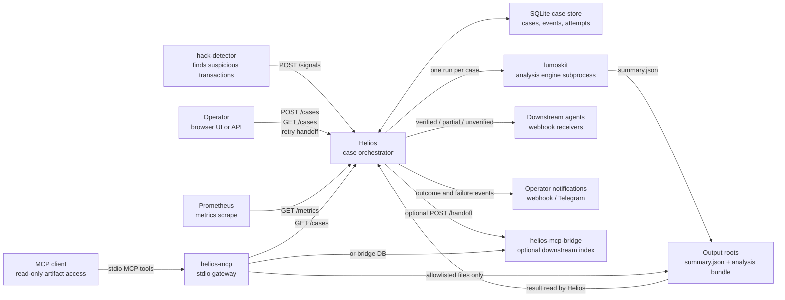
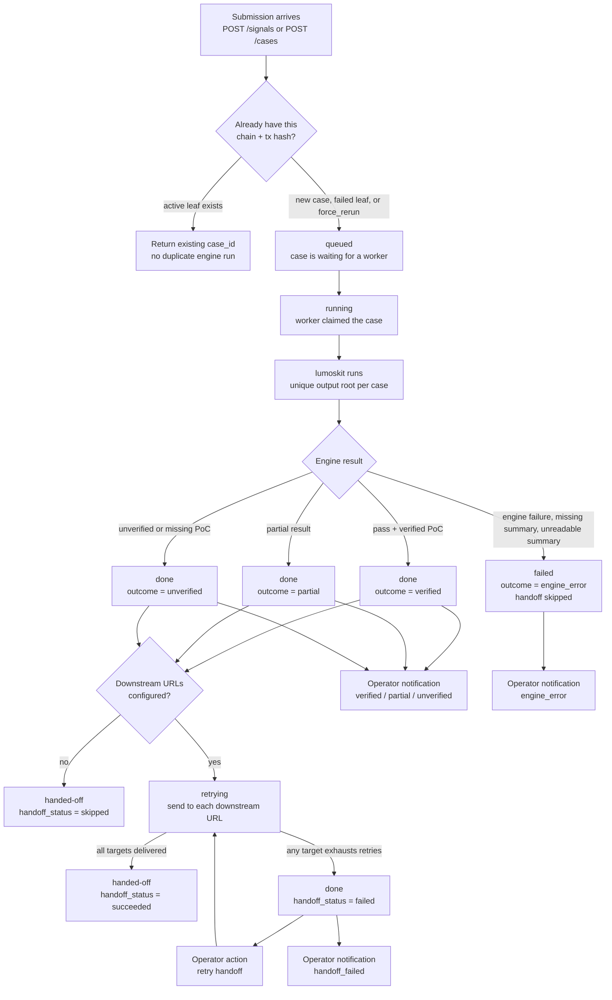

# Helios operator architecture and workflow

This page is for operators and teammates who need to understand what Helios
_does_ during an incident. It intentionally avoids package-level or code-level
details.

Helios is the middle service in the Lumos incident workflow:

1. a suspicious transaction is submitted,
2. Helios turns it into a tracked case,
3. Helios runs `lumoskit` for that case,
4. Helios records the result,
5. Helios hands the result to downstream agents and notifies operators.

## System view



### Boundary summary

| Area | Owner | Operator takeaway |
| --- | --- | --- |
| Detecting suspicious transactions | `hack-detector` | Helios receives already-detected transactions; it does not decide what is suspicious. |
| Running forensic analysis and PoC generation | `lumoskit` | Helios launches `lumoskit` and reads its `summary.json`; it does not perform the analysis itself. |
| Case tracking, retries, handoff, notifications | Helios | This is the service operators watch and control during incident processing. |
| MCP assistant access | `helios-mcp` / `helios-mcp-bridge` | Read-only access to case metadata and `summary.json`, `summary.md`, `rca.md`, `PoC.t.sol`; no engine execution, writes, shell, or arbitrary filesystem access. |
| Downstream follow-up | Webhook receivers / agents | They receive completed non-engine-error cases from Helios. |

## Case workflow



## What operators should watch

| Field / surface | What it means | Typical action |
| --- | --- | --- |
| `case_id` | Stable ID for one Helios attempt. | Use it when opening the UI detail page, searching logs, or retrying handoff. |
| `state=queued` | The case is waiting for an available worker slot. | Check queue depth and `HELIOS_MAX_CONCURRENT_LUMOSKIT` if many cases wait. |
| `state=running` | `lumoskit` is currently running for this case. | Wait, or inspect host resources if it stays running unexpectedly long. |
| `state=done` | `lumoskit` finished with a non-engine-error outcome. | Check `outcome` and `handoff_status`. |
| `state=handed-off` | Helios is finished with the case. | Downstream systems should now have the result, or handoff was intentionally skipped. |
| `state=failed` + `outcome=engine_error` | The engine run failed or the summary could not be used. | Inspect `failure_kind`, `summary_json_path`, output files, and operator notifications. |
| `outcome=verified` | The case produced a verified PoC. | Treat as high-confidence downstream material. |
| `outcome=partial` | The engine produced useful but incomplete material. | Review the output bundle before relying on it fully. |
| `outcome=unverified` | The engine completed but did not verify the PoC. | Review manually or rerun with better inputs if needed. |
| `handoff_status=retrying` | Helios is still delivering to downstream URLs. | Wait unless attempts are repeatedly failing. |
| `handoff_status=failed` | At least one downstream URL exhausted its retry budget. | Fix the receiver or network, then call `POST /cases/{case_id}/retry-handoff`. |
| `notification_status=failed` | Operator notification delivery failed. | Fix webhook or Telegram configuration; case processing itself is not blocked. |

## Operator checklist for a case

1. Open the case in the UI or call `GET /cases/{case_id}`.
2. Check `state` first.
3. If `state=done` or `state=handed-off`, check `outcome`.
4. If `outcome=engine_error`, check `failure_kind` and `summary_json_path`.
5. If `handoff_status=failed`, inspect `handoff_attempts` and retry handoff after the receiver is healthy.
6. If notifications are missing, inspect `notification_attempts`; this does not change the case result.
7. For fleet-level health, watch `/metrics` and queue depth.

## MCP assistant workflow

MCP support is a local read-only gateway for assistant clients.

Direct mode:

```text
MCP client -> helios-mcp stdio process -> Helios HTTP API + allowlisted output files
```

Indexed mode:

```text
Helios -> POST /handoff -> helios-mcp-bridge SQLite index
MCP client -> helios-mcp stdio process -> bridge index + allowlisted output files
```

It intentionally does not replace downstream handoff. The bridge is just another
downstream receiver that keeps a local read model for assistant queries.

## Special operational paths

### Duplicate submissions

Helios deduplicates by `(chain, tx_hash)` against the latest lineage leaf.
Repeated submissions for an active or completed leaf return the existing case
instead of starting another engine run. A failed leaf, an automatic restart
recovery, or a manual `force_rerun` creates a linked child case.

### Restart recovery

If Helios restarts while a case is `running`, it cannot safely assume the old
child process completed. On startup, Helios marks the old running case as:

```text
state=failed, outcome=engine_error, failure_kind=host_restart
```

Then it queues a new linked child case with a fresh output root.

### Empty downstream URL list

If `HELIOS_DOWNSTREAM_WEBHOOK_URLS` is empty, successful engine outcomes still
finish normally. Helios immediately moves the case to:

```text
state=handed-off, handoff_status=skipped
```

This means no external handoff was configured; it is not an error.

### Engine errors

Engine-error cases are not sent to downstream receivers. They only generate an
operator notification when a notification channel is configured.
