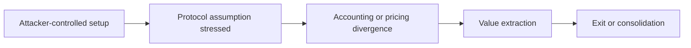

# Draft X Exploit Thread

## Overview

Turn a sanitized exploit brief into a compact alert, substantive long-form post, or concise public thread with a clear security thesis, useful context, and publishable caveats. Never draft directly from raw private reports unless the first output is a sanitized brief.

## Required Inputs

- A sanitized brief from `sanitize-exploit-report`, or equivalent public-safe notes.
- Incident date/time, with basis: public tx timestamp, block timestamp, monitoring alert, report timestamp, or under review.
- Protocol X handle and verification source, or `under review` when no official handle is confirmed.
- Intended audience: security researchers, builders, traders, protocol teams, or general crypto audience.
- Posting mode: compact main post, rich long-form single post, short exploratory thread, Typefully draft, or diagram-led thread.

If only private artifacts are provided, first invoke or perform the `sanitize-exploit-report` workflow and stop before writing a public draft if the disclosure boundary is unclear.

## Workflow

1. Validate the disclosure and claim boundary.
   - Accept only a public-safe brief; keep the internal redaction ledger out of context.
   - Confirm which claims, entities, timestamps, addresses, and amounts are approved for drafting.
   - Verify any protocol X handle from an operator-approved value or an official project website/documentation link. Never infer it from a similar display name, hashtag, aggregator, or security alert account.
   - Stop when disclosure status or coordinated-disclosure readiness is unclear.

2. Select the posting mode and evidence status.
   - Default incident coverage to one compact main post plus, only when useful, one evidence reply.
   - Use a rich long-form single post when the operator says the compact draft is too short, thin, or insufficiently explanatory.
   - Choose a 4-7 post exploratory thread only when the user explicitly wants deeper analysis.
   - Derive evidence status internally from the approved evidence; do not print RCA, PoC, Forge, or verification badges in the public copy.

3. Choose the angle.
   - Incident lens: what happened and why it matters now.
   - Exploit primitive lens: what pattern this reveals.
   - Builder lens: what design assumption failed.
   - Market lens: how value moved and why observers should care.

4. Draft a hook that is accurate before it is clever.
   - Lead with the exploit perspective, not a vague alert.
   - Tag the verified protocol handle once at the first protocol mention while retaining the public display name. Use the display name without a tag when the handle is absent or under review.
   - Avoid sensational claims, blame, or identity attribution.
   - Avoid "full breakdown" language if details are intentionally abstracted.

5. Build the thread.
   - Read `references/incident-post-format.md` when the user asks for the Backlight incident format, incident alert, main post, or reply thread.
   - Put protocol, chain, incident time, estimated loss, and a one- or two-sentence mechanism summary in the main post.
   - For rich long-form mode, include `Key info`, `TL;DR`, causal explanation, `Why it matters`, a builder takeaway, and any material loss caveat in the single main post.
   - In rich long-form mode, keep the only reply to the approved transaction explorer link unless the operator asks for a thread.
   - Outside rich long-form mode, put the explorer link and optional beginner-friendly context in one reply; omit the reply when it adds no useful public evidence.
   - Use 4-7 posts only for explicitly requested exploratory threads.
   - Each post should carry one idea.
   - Keep numbers and entities generalized unless explicitly publishable.
   - Include one visual candidate when it clarifies attacker behavior, asset movement, or failed assumptions.
   - Use `exploit-flow-card` only after creating its explicit public card packet when the user asks for an X image/card, attack-flow visual, money-movement diagram, or social preview asset.

6. Validate the complete package.
   - Read `references/thread-style.md`.
   - Read `references/visual-artifacts.md` before recommending images.
   - Before recommending or rendering a visual, identify the one visualizable value it protects: causal hinge, state-consumer boundary, false-lead split, broken invariant, numeric gap, money-realization path, or selected asset movement.
   - Use `exploit-flow-card/scripts/render_card.py` for the visual. Do not pass raw `asset_deltas.dot` or `run_summary` downstream; put only approved selected movement in the public card packet.
   - Check that every claim traces back to the sanitized brief.
   - Remove reproduction detail and raw private provenance.
   - Stop at the approved draft package. Hand the final main text, transaction-only reply, and card path to Backlight's existing x-feed/X publisher; do not add an X API client to this skill bundle.

## Output Format

```markdown
## Feed Draft

### Angle
[Selected editorial angle and audience.]

### X Thread
Main Post:
[Compact incident post, or a rich long-form post with Key info, TL;DR, causal explanation, why it matters, builder takeaway, caveat, and one primary visual when safe.]

Reply Thread:
1. [For compact mode: optional public-safe context and approved links. For rich long-form mode: transaction explorer URL only unless the operator requests a thread.]

### Typefully Notes
- [Line breaks, optional variants, or timing notes]

### Diagram
[Mermaid diagram or concise diagram brief.]

### Visual Recommendation
[Recommended image/artifact, visualizable value, transformation, and why it is safe/useful.]

### Safety Check
- [What was generalized]
- [Claims with medium/low confidence]
- [Anything that still needs approval before posting]
```

## Diagram Template

Use Mermaid for high-level diagrams when the user asks for a visual or when a thread would benefit from one:



Keep diagrams conceptual. Do not include exact tx order, calldata, function names, or private labels.

## Style Rules

- Prefer concrete verbs over hype.
- Prefer "the interesting part is..." over generic alert phrasing.
- Avoid exploit tutorials, leaked detail, and "how to reproduce" framing.
- Include uncertainty in the post, not only in internal notes, when uncertainty affects interpretation.
