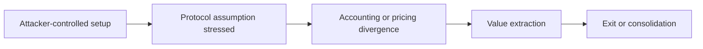

# Draft X Exploit Thread

## Overview

Turn a sanitized exploit brief into a concise public thread with a clear security thesis, useful context, and publishable caveats. Never draft directly from raw private reports unless the first output is a sanitized brief.

## Required Inputs

- A sanitized brief from `sanitize-exploit-report`, or equivalent public-safe notes.
- Incident date/time, with basis: public tx timestamp, block timestamp, monitoring alert, report timestamp, or under review.
- Intended audience: security researchers, builders, traders, protocol teams, or general crypto audience.
- Posting mode: main post plus reply thread, short exploratory thread, Typefully draft, or diagram-led thread.

If only private artifacts are provided, first invoke or perform the `sanitize-exploit-report` workflow and stop before writing a public draft if the disclosure boundary is unclear.

## Workflow

1. Choose the angle.
   - Incident lens: what happened and why it matters now.
   - Exploit primitive lens: what pattern this reveals.
   - Builder lens: what design assumption failed.
   - Market lens: how value moved and why observers should care.

2. Draft a hook that is accurate before it is clever.
   - Lead with the exploit perspective, not a vague alert.
   - Avoid sensational claims, blame, or identity attribution.
   - Avoid "full breakdown" language if details are intentionally abstracted.

3. Build the thread.
   - Read `references/incident-post-format.md` when the user asks for the Backlight incident format, incident alert, main post, or reply thread.
   - Use 4-7 posts for exploratory threads; use the Backlight incident card format for alerts and verified incident posts.
   - Each post should carry one idea.
   - Keep numbers and entities generalized unless explicitly publishable.
   - Include one visual candidate when it clarifies attacker behavior, asset movement, or failed assumptions.
   - Use `exploit-flow-card` when the user asks for an X image/card, attack-flow visual, money-movement diagram, or social preview asset.

4. Run the safety pass.
   - Read `references/thread-style.md`.
   - Read `references/visual-artifacts.md` before recommending images.
   - Before recommending or rendering a visual, identify the one visualizable value it protects: causal hinge, state-consumer boundary, false-lead split, broken invariant, numeric gap, money-realization path, or selected asset movement.
   - Use `exploit-flow-card/scripts/render_card.py` for the visual. When `asset_deltas.dot` or `run_summary` asset legs exist, fold selected movement into the same flow card instead of producing a second graph.
   - Check that every claim traces back to the sanitized brief.
   - Remove reproduction detail and raw private provenance.

## Output Format

```markdown
## Feed Draft

### Angle
[Selected editorial angle and audience.]

### X Thread
Main Post:
[Core incident post with protocol/chain headline, tx hash, date/time, impact, root cause, beginner-friendly three-line explanation, CTA to replies, and one primary visual when safe.]

Reply Thread:
1. [Artifacts with report/PoC, beginner-friendly public analysis, and explorer URL. Attacker CA is opt-in only.]

### Telegram Publish
[Main X body exactly, followed by GitHub and X links.]

### Typefully Notes
- [Line breaks, optional variants, or timing notes]

### Diagram
[Mermaid diagram or concise diagram brief.]

### Visual Recommendation
[Recommended image/artifact, visualizable value, transformation, and why it is safe/useful.]

### Safety Check
- [What was generalized]
- [Claims with medium/low confidence]
- [Anything that still needs approval before posting]
```

## Diagram Template

Use Mermaid for high-level diagrams when the user asks for a visual or when a thread would benefit from one:



Keep diagrams conceptual. Do not include exact tx order, calldata, function names, or private labels.

## Style Rules

- Prefer concrete verbs over hype.
- Prefer "the interesting part is..." over generic alert phrasing.
- Avoid exploit tutorials, leaked detail, and "how to reproduce" framing.
- Include uncertainty in the post, not only in internal notes, when uncertainty affects interpretation.
